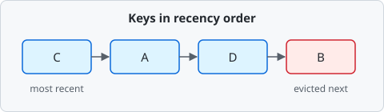

## Cache eviction {#cache-eviction}

A cache has limited capacity, so it needs a rule for removing entries when it fills up. An **LRU** (least recently used) cache removes the entry that has gone longest without being read. Combining a hash map with a doubly linked list supports lookup and eviction in $O(1)$.



```python
from collections import OrderedDict

class LRUCache:
    def __init__(self, capacity):
        self.capacity = capacity
        self.entries = OrderedDict()

    def get(self, key):
        self.entries.move_to_end(key)
        return self.entries[key]
```

Reading an entry moves it to the most recently used end of the list. When space is needed, the cache removes an entry from the least recently used end.

?? lru-evict Which entry does an LRU cache evict first?
* The least recently used entry
* The entry that has gone longest without being read
- The most recently used entry
- The largest entry
- The oldest inserted entry
- A random entry
> LRU tracks access order and removes the entry that has gone longest without being read.

?+ Keys A, B, and C are inserted in that order. Then A is read. Which key does LRU evict next?
* B
- A
- C
> After A is read, B is the least recently used key.

?? lru-cost [tf] LRU lookups take $O(n)$ time.
* false
> With a hash map and a doubly linked list, both lookup and eviction are $O(1)$.

?? fifo-name [short] Name the eviction policy that removes the oldest inserted entry.
= FIFO | first in first out
> FIFO ignores reads and evicts in insertion order.

## Hit rate {#hit-rate}

A cache hit occurs when a lookup finds the requested data in the cache. The hit rate is the fraction of lookups that are hits:

$$ hit\ rate = \frac{hits}{hits + misses} $$

If a cache answers 80 out of 100 lookups, its hit rate is $0.8$. At a hit rate of $0.9$, 1000 lookups produce 100 misses. If each miss costs \$0.002 of database time, those misses cost $100 \times 0.002 = 0.2$ dollars.

| Hit rate | Misses per 100 lookups |
| -------- | ---------------------- |
| 0.50     | 50                     |
| 0.90     | 10                     |
| 0.99     | 1                      |

```ts
function hitRate(hits: number, misses: number): number {
  return hits / (hits + misses)
}
```

?? hit-rate-formula [n=5] Which expression is the hit rate?
* $\frac{hits}{hits + misses}$
* $\frac{hits}{lookups}$
- $\frac{misses}{hits + misses}$
- $\frac{hits}{misses}$
- $hits - misses$
- $\frac{misses}{lookups}$
- $hits + misses$
> Every lookup is either a hit or a miss, so $hits + misses$ gives the total number of lookups. Divide hits by that total to find the hit rate.

?? hit-rate-calc [short] A cache answers 90 of 100 lookups. What is its hit rate as a decimal?
= 0.9 | .9 | 0.90
> $90 / 100 = 0.9$.

?+ [tf] A cache with a hit rate of 0.5 misses on half of its lookups.
* true
> The miss rate is $1 - 0.5 = 0.5$.

## Write policies {#write-policies}

When data changes, choose how updates reach the cache and the store behind it. Three common policies are:

- **Write-through** writes to the cache and the store together. Reads stay fresh, but every write pays for the slower store.
- **Write-back** writes to the cache and marks the entry dirty. The store is updated later, when the entry is evicted.
- **Write-around** writes to the store only. The cache fills on the next read.

?? write-policies-store [multi] Which policies send every write to the store immediately?
* Write-through
* Write-around
- Write-back
- Read-through
- Refresh-ahead
> Write-through and write-around both send each write straight to the store. Write-back waits until the entry is evicted.
