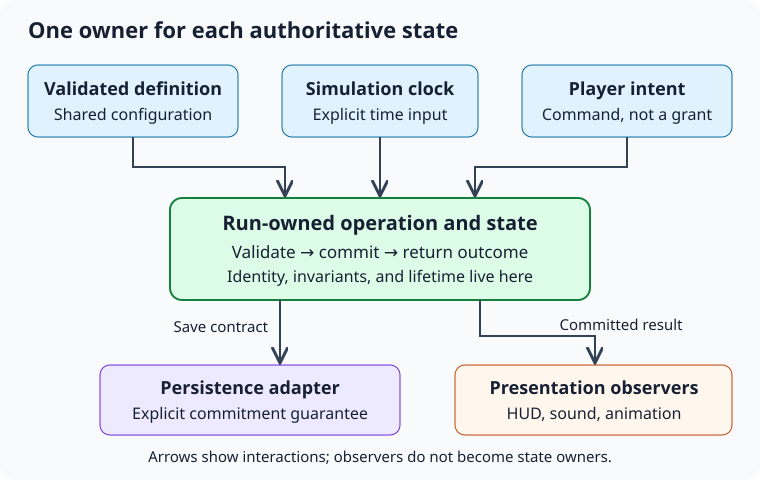

## How to study and explain an engineering decision {#engineering-study-method}

Start with a gameplay feature. Decide which part of the code owns its state, then explain what happens when something fails. The later chapters build on those decisions: they cover C#, Unity production work, algorithms, mobile performance, live operations, collaboration, and examples from your own projects. The order runs from design reasoning to production concerns, which is roughly how a technical interview works through them. Published interview reports can suggest topics to practise, but one candidate's experience cannot tell you what a studio will ask next.

The running example is an imaginary mobile runner. Players collect coins, activate power-ups, complete missions, and participate in seasonal events. The requirements are invented for the exercises; they make no claims about the internals of any commercial game.

| Preparation area | Chapters |
| --- | --- |
| System design and architecture | 1–3, with the capstone in 15 |
| C# and software-engineering fundamentals | 4–5 |
| Unity production behavior and debugging | 6–8 |
| Data structures and game algorithms | 9–10 |
| Mobile performance and resource budgets | 11–12 |
| LiveOps and safe releases | 13 |
| Cross-disciplinary collaboration | 14 |
| Previous projects and interview practice | 15 |

Read each section, explain its main decision aloud, and then answer the questions. Multiple choice tests whether you recognize an answer; designing a system takes more practice. Close the book and draw which objects own the data, along with when those objects are created and destroyed. Then change one requirement and check whether your design still works.

The explanations use Unity 6.0 as their reference version. Package APIs, platform capabilities, and C# support can differ between Editor and package versions; links to versioned documentation are included where those differences matter. Each example focuses on a particular rule, and any project-specific types or pseudocode are identified. A complete Unity project or backend would also need the code that connects those examples to the rest of the system. You can read the textbook and answer its questions offline. Opening the optional documentation links requires a connection.

Build a technical answer around these questions:

1. Requirement: What player or authoring behavior is needed?
2. Constraint: What limits the solution: time, devices, existing saves, team practices?
3. Invariant: What must remain true even during failure or unusual ordering?
4. Ownership: Who controls the authoritative state and its lifetime?
5. Mechanism: Which types and operations enforce those rules?
6. Tradeoff: What does the choice cost, and when would you choose differently?
7. Evidence: Which tests, measurements, or production observations support it?

For example, “I used interfaces and events” names mechanisms. “The run owns power-up state; presentation observes committed changes; a clock parameter lets us test expiration exactly at the boundary” explains a design.

?? architecture-answer-evidence Which answer best demonstrates an architectural decision?
* The run owns effect state, so a restart cannot keep timers from the previous run. Restart tests check this behavior.
- The system uses several well-known patterns, so it must be maintainable.
- Every type has an interface, so all dependencies are automatically correct.
- A single manager owns everything because fewer files always mean less complexity.
- The design resembles a popular repository, so alternatives need no discussion.
> Explain the requirement, ownership decision, and evidence. A pattern name alone does not establish that a design solves the actual problem.

?? preparation-evidence [tf] One candidate's interview report is enough to establish the exact technical syllabus for a future interview.
* false
> An interview report describes one person's experience. Prioritize the topics a studio's own products make likely, and practise explaining decisions you could apply to different problems.

## Turn a feature request into a contract {#architecture-requirements}

“Add a coin magnet” leaves most engineering decisions unresolved. Does it attract coins through walls? Does it stack with another magnet? Does the duration pause during menus? Does death end it? Can a designer change its range without a code build? Can an attraction already in progress finish after the effect expires?

Start with a short description of what the player should experience. Then write down the behavior they can observe. Separate functional rules from quality requirements. “Coins inside the radius move toward the player” describes what the feature does. “The feature fits the remaining frame budget on the minimum supported device” limits how much work it can do. “Designers can preview the radius in a test scene” describes what the authoring tools must support.

Record the behavior for each edge case:

| Situation | Example contract |
| --- | --- |
| Collect a second magnet | Refresh the remaining time to the configured duration |
| Open a pause menu | Stop gameplay simulation time and attraction movement |
| Restart the run | Remove every active effect and release all run-owned objects |
| Coin enters two detection paths | Award it at most once |
| Invalid configuration | Reject it during content validation; use a defined runtime fallback |
| Coin already moving when magnet expires | Finish that attraction, provided the run is still active |

Another game may choose different policies. Once the team agrees on them, use the same rules in gameplay, presentation, and tests.

An invariant is a rule that must remain true, including when events arrive in an unusual order or something fails. For example, “A coin is collected at most once per run” must still hold if a collision callback repeats, an animation finishes late, or two detection systems find the same coin. The rule “The reward balance never decreases during collection” also affects validation: reject negative values and prevent arithmetic overflow.

Also record what the first version will leave out. A local prototype may not need a trusted server, saves shared across devices, or configurable stacking combinations. Leaving those features out reduces the work needed now. Keep the operations that change game state separate from presentation, though; that gives a future authority a place to apply the rules without adding a service to the prototype.

Finish by writing concrete examples the team can use to accept the feature. For instance, pause a run with three seconds of an effect remaining, then wait ten seconds in real time: the effect should still have three gameplay seconds left. Examples like this become tests and give designers a precise way to check the intended behavior.

?? architecture-invariant Which statement is an invariant for coin collection?
* A particular coin can increase the run's balance at most once.
* Repeated delivery of the same collection must not increase the reward again.
- The collection animation lasts approximately half a second.
- The magnet icon should look appealing.
- Most players should collect several coins.
- The implementation should have five classes.
> An invariant is a rule that must hold across valid execution paths, including retries, duplicated callbacks, and unusual ordering.

?+ A collision callback and a magnet callback both report the same coin. Which requirement directly determines the correct behavior?
* Collection is idempotent for that coin's identity within the run.
- The magnet should use a circular visual effect.
- Coin prefabs should have descriptive names.
- The run uses a fixed target frame rate.
> Idempotent collection means repeating the same logical operation has no additional reward effect.

## Assign responsibilities and identify sources of truth {#architecture-responsibilities}

A responsibility describes a kind of work that may need to change. The magnet's duration rule changes when designers change stacking; the sound player changes when audio integration changes. The save adapter has a different job again: it handles changes to storage. Putting all of them together makes a small balance change riskier, because the same code also handles unrelated behavior.

A practical decomposition for the runner is:

| Unit | Owns | Does not decide |
| --- | --- | --- |
| Run session | Run identity, phase, run lifetime | Audio mixing |
| Effect model | Activation, expiration, stacking policy | Prefab selection |
| Coin registry | Active coin identities and positions | Reward amounts |
| Collection operation | Eligibility and one-time collection transition | Animation timing |
| Wallet or run score | Valid balance changes | Collider filtering |
| Presentation | Icons, sounds, particles, visual interpolation | Whether a reward is earned |

Choose one object to control each piece of state. If the HUD and the effect model each count down their own timer, they can disagree after a pause, a rounding difference, or a delayed frame. Have the HUD calculate its display from the effect model's deadline, using the same clock.

The table does not require a separate class for every row. In a small feature, the registry and collection operation may fit together. Split them when they need different lifetimes, change for different reasons, or are easier to test separately. Too many small pieces can make a single operation difficult to follow.

Keep the current state, the rules that change it, and the resulting presentation easy to distinguish. The state says the magnet expires at simulation time 42. The stacking rule says another pickup refreshes its duration. Presentation plays the sound and updates the icon. You should be able to understand the state and rules even if all of the scene's visuals are replaced.

Name operations after what the caller wants to do: `TryCollect(coinId)`, `ActivateMagnet(duration)`, or `FinishRun(reason)`. A public setter such as `Collected = true` allows callers to skip the reward rule. A collection operation can check whether the transition is allowed, update the related state, and return a result that says what happened.

When drawing the design, use different arrows for ownership and notifications. A HUD can receive updates from a run without owning that run. The run can own a collection registry while keeping other objects from changing it directly.



?? architecture-source-of-truth The HUD and gameplay each maintain a separate magnet timer. What is the main architectural risk?
* Their copies can diverge after pause, refresh, or delayed updates.
- Reading a timer from another object always allocates memory.
- Unity forbids multiple timers in one scene.
- The HUD must always own every gameplay deadline.
> When two objects each control a copy of the same state, those copies can disagree. Have the display read the state from the object that owns the rule.

?+ A power-up expires correctly, but its icon stays visible after reopening the HUD. Which design most directly prevents that discrepancy?
* Rebuild the icon from the effect owner's current state whenever the view binds.
- Persist a separate HUD timer and never compare it with gameplay.
- Extend the gameplay effect whenever the icon is visible.
- Rely only on the expiration event, even while the HUD is unsubscribed.
> A view can miss events while it is closed. When it binds again, read the owner's current state to rebuild the display; use notifications to keep it current afterward.

?? architecture-encapsulation Why prefer `TryCollect(id)` over a publicly settable `Collected` property?
* The operation can check eligibility, prevent repeat collection, and update the balance together.
- Methods always execute faster than properties.
- A method automatically makes the operation thread-safe.
- Properties cannot be tested.
> Encapsulation protects an invariant by controlling how state changes. A method name alone does not provide atomicity or thread safety; its implementation and calling contract must do that.

## Direct dependencies, composition roots, and lifetimes {#architecture-dependencies}

A dependency is anything a unit needs to do its job: another object, global state, a clock, a random source, a scene, or even an initialization convention. Constructor parameters make dependencies visible. Global lookups and static access hide them.

Give ordinary C# objects what they need when you construct them, so they start in a valid state. For example, a mission evaluator can receive immutable definitions and a progress store. Unity components can use serialized references for connections made in the Inspector. A composition root then creates the ordinary objects and connects them to those components. This is simply the place where the objects are assembled; it does not require a dependency-injection framework.

Match object lifetimes explicitly:

| Lifetime | Examples | Cleanup boundary |
| --- | --- | --- |
| Application | Settings, installed catalog, platform adapter | Application shutdown or explicit replacement |
| Player session | Loaded profile, authenticated identity | Logout or profile switch |
| Scene | Scene bindings, cameras | Scene unload |
| Run | Score, effects, mission event buffer | Run end or restart |
| View | Subscriptions, pending artwork request | Hide, unbind, or destroy, according to its contract |

Check any service that keeps a reference to an object with a shorter lifetime. A static event, for example, can keep a scene HUD's managed wrapper reachable after the scene unloads. A task started by a view may also finish after that view has been reused for another item. Both are lifetime bugs, even if neither produces an exception.

Use an interface when callers should depend on an operation without knowing its implementation. Examples include a clock, a storage operation, a reward service, or a selection policy that can be replaced. An immutable definition can remain a concrete type: if callers only need its data, an interface may add little.

Each way of connecting dependencies has costs. Inspector references work well for stable relationships in a scene, but some objects and connections only exist at runtime. Explicit factories can create those objects; the design still needs to say who owns and cleans them up. A dependency-injection (DI) container can manage a large set of objects and their lifetimes, but introduces registration errors and another layer to debug. A service locator makes objects easy to find, while hiding which dependencies each caller needs.

?? architecture-lifetime A persistent service subscribes a scene HUD to its event. Which responsibility must be assigned?
* The HUD or its binding owner must unsubscribe when that binding's lifetime ends.
- Garbage collection must infer that the scene no longer needs notifications.
- Every subscriber should become persistent.
- The event should invoke only during `Update`, which prevents lifetime problems.
> The publisher keeps delegates that refer to its subscribers. Unsubscribe when the binding ends, so the publisher does not keep the old HUD or send it notifications after the scene unloads.

?+ Which dependency is most useful to inject into a rule that expires effects?
* The relevant clock or the current time value.
- The entire scene hierarchy.
- Every registered service, whether needed or not.
- A global singleton that reads wall time internally.
> Supplying time explicitly makes pause behavior and exact expiration boundaries controllable in tests.

## Commands, events, and failure ordering {#architecture-communication}

A command asks an owner to perform an action: collect a coin, spend currency, or start a run. That owner accepts or rejects the request. An event reports something that has already happened: a coin was collected, currency was spent, or a run started. Keeping the distinction clear makes it easier to follow why state changed.

Prefer a direct call when a caller needs a result from one owner. `TrySpend(amount)` can return insufficient funds. Publishing `PleaseSpendMoney` and hoping an unknown subscriber responds hides the operation's completion and error handling.

Use notifications when several independent observers need to know about a change that has already been committed. A collected coin might update the HUD, play a sound, and advance a mission. Decide which of those actions are required for correct gameplay. If collection must advance mission progress, that update must be guaranteed even if the code receives it through an event subscription.

The safe order for a small local transaction is:

```text
Validate command
Prepare all required changes
Commit authoritative state
Record or return the result
Notify presentation observers
```

A C# multicast event calls its handlers synchronously, in order, until one throws. The state may already have changed when the exception occurs, and later handlers will not run. For a critical operation, return the committed result independently of presentation. Decide how observer errors are caught, and log enough context to investigate them. An animation error must not cause an already granted reward to be granted again.

An event handler can issue another command before the original call returns. This is called reentrancy. Set the state before notifying observers, and decide how to handle nested commands: reject transitions that are invalid, or queue commands to process later. A queue makes the order visible, but someone must own it, and commands now wait before running.

An event bus lets publishers notify subscribers without holding direct references to them. The tradeoff is that subscribers become harder to find. You also need rules for delivery order, how long subscriptions are retained, and whether events can be replayed. Include run IDs, stable entity IDs, or operation IDs in event data when receivers need them to recognize stale or duplicate work.

?? architecture-command-event A purchase button needs to know whether the player has enough currency. Which interaction is clearest?
* Call the purchase operation and receive an explicit success or failure result.
- Broadcast a presentation event and assume a subscriber performed the purchase.
- Update the balance label first and infer success from its text.
- Let each listener independently deduct the price.
> An operation with one authority should expose its result directly. Notifications can follow after the authoritative decision.

?+ A mission counter must advance whenever a collection commits. What must the architecture specify if it uses events for that update?
* Rules for event delivery and failure handling that ensure mission progress is updated.
- That any optional observer may perform the update if it happens to be loaded.
- That playing the coin sound establishes mission progress.
- That an event name alone guarantees durable delivery.
> If collection requires a mission update, event delivery must guarantee that update. Treating the mission tracker as an optional listener could leave progress incorrect.

?? architecture-notification-failure A reward is committed, then its celebration animation throws. What should a retry policy preserve?
* The same logical reward must not be granted a second time.
- Every animation exception should reset the player's balance.
- A failed observer proves the original reward never happened.
- Repeating all state changes is safe because the call threw.
> The reward was already granted before the animation failed. A safe retry must recognize that completed operation and avoid granting it again.

## Evaluate architecture with change scenarios {#architecture-tradeoffs}

Evaluate a design by trying the changes it is likely to face.

For the magnet, ask: can a designer tune duration without changing collection code? Can two players have independent effects? Can a test advance time without loading a scene? Can a run restart during attraction? Can a new renderer replace particles without changing reward rules? Can a programmer trace one collection from input to saved result?

These goals can conflict. A generic effect framework may support many combinations, yet make a simple magnet difficult to debug: following its configuration might take you through six registries. A direct implementation is easier to inspect, but copied power-up code can develop inconsistent behavior. Share rules that are already common, such as expiration and stacking, while keeping each feature's behavior easy to find.

Record major decisions in a short architecture decision record:

```text
Context: Three effects share duration and pause semantics.
Decision: One run-owned timer model, separate effect behaviors.
Alternative: A global effect manager.
Reason rejected: It mixes runs and complicates isolated tests.
Cost: Explicit construction and binding at run start.
Revisit when: Effects must persist across runs or synchronize online.
Evidence: Restart, pause, and boundary tests; device profiling.
```

Resource management involves similar tradeoffs. Preloading reduces waiting during a transition, but keeps more data in memory. Extra layers can make implementations easier to replace, but add steps when tracing a call. Caching avoids repeated computation; it also requires rules for clearing stale values and releasing retained data.

Choose the smallest design that meets today's requirements and the changes you reasonably expect soon. Make decisions that are difficult to reverse easy to find: saved identifiers, content formats, public APIs, and which modules depend on which. Internal class arrangements are usually easier to change later.

In an interview, articulate one rejected alternative and a condition under which it would become reasonable. “I rejected a global manager because runs require independent state; an application-wide catalog would still be shared” shows judgment more clearly than “singletons are bad.”

?? architecture-tradeoff A preload strategy eliminates a transition hitch but doubles peak memory. What is the next engineering decision?
* Compare the latency improvement and peak memory against the actual device budgets.
- Accept it because lower latency always dominates memory usage.
- Reject it because caching is always premature optimization.
- Hide the extra memory in a different subsystem's accounting.
> Tradeoffs require explicit budgets and measurements. A local improvement can make the whole product less reliable.

?? architecture-rejected-alternative What makes discussion of a rejected alternative useful?
* Explain which requirement it failed and when it would become appropriate.
- Describe it as inherently unprofessional.
- List its pattern name without discussing behavior.
- Claim the selected approach has no costs.
> Alternatives demonstrate reasoning when they are evaluated against constraints rather than personal preference.
