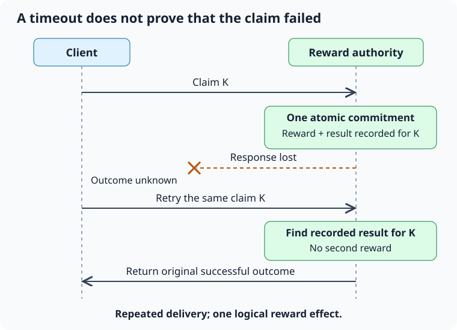

## Model progress as facts evaluated against definitions {#missions-progress-model}

Keep three things separate in a mission system: the mission's requirements, the player's progress, and whether the reward has been claimed. Each answers a different question and changes for a different reason.

The mission definition might contain a stable ID, revision, objective type, target, eligible game mode, reward, and availability window. Progress stores how much the player has completed. Claim state records the operation that granted the reward and its result. Editing the description must not change the mission's identity. Changing the target during an active mission needs a separate decision: migrate existing progress, or let active missions keep their original definition revision.

Start with clear objective categories, such as collecting coins, finishing runs, and covering a distance. An event for a completed action carries the facts needed to evaluate those objectives:

```text
RunEvent:
  eventId
  runId
  sequence
  eventKind
  amount
  modeId
  simulationTick
```

A small offline game can update counters directly; it does not need to save every event shown in this schema. Keeping events can help you investigate their order, replay rules, or process delayed work. It also uses storage and creates another data format that must remain compatible over time.

Specify exactly what each amount measures. For distance, the simulation might accumulate whole centimeters, avoiding repeated rounding of the meter value shown on screen. Scope matters too: “collect 100 coins in one run” needs a counter that resets at a defined run boundary, while “collect 100 coins across runs” keeps its total between runs.

If progress beyond the target has no meaning, stop the displayed and stored count at the target. This also makes the UI simpler. Choose a numeric type large enough for the values you accept, and check the input before adding it. If addition overflows, clamping the result afterward cannot repair the lost value.

Start by checking each active mission against an event. If the number of missions or measured cost makes that too expensive, group missions by the kinds of events they use. For example, if only three of fifty missions react to coin collection, evaluate those three. This index needs maintenance whenever the active missions change, so add it when the benefit justifies that work.

Written as three records, the separation becomes concrete:

```text
MissionDefinition         MissionProgress          MissionClaim
  missionId                 missionId                missionId
  revision                  definitionRevision       claimId
  objectiveKind             amount                   grantedAt
  target                    target (captured)        rewardSnapshot
  modeId                    completedAt              result
  reward                                             definitionRevision
  availability
```

Notice what each record repeats. Progress captures the revision and target it was measured against, so a later definition change cannot silently reinterpret an old number. The claim captures what was actually granted, so recovering an old claim never depends on today's reward table. Copying a value like this is not redundancy; each copy answers a question at a different moment.

Changing a definition mid-flight then becomes a choice you can state in a table:

| Change | Existing progress | Typical policy |
| --- | --- | --- |
| Description or icon | Unaffected | Apply immediately |
| Target lowered | May now exceed the new target | Clamp, and allow completion |
| Target raised | Now further from completion | Pin active missions to their captured revision |
| Objective kind changed | No longer comparable | Treat as a new mission ID |

The last row is the one teams get wrong. Reusing an ID for a different objective makes old progress records mean something they were never measured for. A new objective is a new mission.

Exercise: For a mission you have seen shipped, write which of those four changes the live game actually allowed, and what it did to players who were halfway through.

?? missions-definition-state A mission's description is translated. Which data should remain stable?
* Its persistent mission identity.
- Its display name, so existing saved references keep resolving.
- The index it occupies in the active mission list.
- A hash of the description text, used as its lookup key.
- The reward amount shown alongside the description.
> Translating the description should not break saved references. If the mission's rules change, decide separately how to version the definition and handle existing progress.

?? missions-scope Why does “collect 100 coins in one run” require different state handling from “collect 100 coins overall”?
* The first objective counts coins within one run and needs a defined point at which that count resets.
- The second needs a larger numeric type, because totals across runs grow without bound.
- The first can reuse the run's score value, while the second needs a separate counter.
- The second has to be recalculated from the event history whenever the game loads.
- The first belongs to the HUD, since it is shown during a run.
> A counter for one run needs an owner and reset rule tied to that run. A total across runs must survive those resets, even though both objectives count coins.

## Ordering, duplicate delivery, and reproducibility {#missions-event-ordering}

Imagine these facts arriving: run finished, coin collected, coin collected again. If the last two messages are delayed or duplicated, incrementing a counter on every callback can corrupt progress.

First define how events are delivered. They might run synchronously within a run, wait in a queue until the end of the frame, or be saved and retried later. Events received from a server have their own delivery rules. Use those guarantees to decide how the receiver handles events that arrive out of order or more than once.

A sequence number tells you an event's position within a stream. An event ID tells you which logical event it is. These are related, but serve different purposes. You can safely skip every sequence below the largest one processed only if the earlier events were already handled or are deliberately irrelevant. If sequence 12 arrives before 11, dropping 11 could lose progress that has never been applied.

For one ordered stream, check that sequence numbers are consecutive. When a number is missing, buffer later events or request the missing event. Unordered delivery needs a different approach: remember recently processed IDs within a defined window, or use a persistent operation store if recovery requirements justify it. Decide when IDs can be forgotten; keeping them forever can exhaust memory or storage.

To reproduce a result, keep more than the random seed. Use the same definitions, starting state, input order, clock rules, and random algorithm. A fixed seed cannot make different event sequences produce the same computation. If the final result depends on floating-point arithmetic, differences between platforms may matter too.

For debugging, record the mission definition revision, run ID, and operation ID. Include the progress before the operation, the amount accepted, the resulting progress, and any rejection reason. Together, these show both what changed and why. Include sensitive player data only when there is a defined need and a suitable way to handle it.

For this local example, a dispatcher that delivers run events in order is enough. Add persistence or support for events arriving out of order only when the delivery rules require it.

Compare the two receivers on the same input, where event 11 is delayed:

```text
Arrival order: 10, 12, 11

Receiver A, "ignore below the highest seen":
  10 applied. highest = 10
  12 applied. highest = 12
  11 discarded. Progress is short by the amount in event 11.

Receiver B, "buffer until the gap closes":
  10 applied. next expected = 11
  12 buffered.
  11 applied, then 12 released from the buffer. Progress is correct.
```

Receiver B costs a buffer and a rule for how long to wait. Decide what happens when the gap never closes: apply the buffered events after a timeout and record the gap, or request the missing event. Waiting forever is the one option that is never acceptable, because the player's progress stops silently.

For unordered delivery, size the remembered set from the delivery window rather than from intuition. If the transport can redeliver within thirty seconds and the game produces at most a hundred events per second, three thousand identifiers cover it, and a sixteen-byte identifier makes that roughly 48 KB. Write the expiry rule next to the set, because a set with no expiry rule is a slow leak that only appears in long sessions.

Exercise: Write down which of the two receivers your current design implements, and what it does when the gap does not close.

?? missions-sequence-gap Events 12 and 11 arrive in that order. Why can “ignore any sequence below the largest seen” be wrong?
* Event 11 may contain valid work that has never been applied.
- Event 12 would then be applied twice, once when it arrives and once after 11.
- The receiver has to retain every sequence number it has seen, which grows without bound.
- Comparing sequence numbers costs more than comparing the event identifiers.
- Event 11 would be applied to the wrong mission, because the numbers have shifted.
> Remembering only the largest sequence number assumes earlier work has already been handled, or is included in a later result. Without that guarantee, ignoring a late event can lose progress.

?+ What is needed in addition to the same random seed for reliable replay?
* The same initial state, rule revisions, input order, and random algorithm.
- A separate seed for each subsystem, drawn again at the start of every replay.
- The recorded output of the original run, so the replay can be compared against it.
- A higher-resolution timer, so the replay reproduces the original frame timing.
- The input device used originally, so the button timings match.
> A seed determines one input to a computation. Other inputs and the order of random consumption also affect its outcome.

## Claim rewards through one authoritative operation {#missions-reward-claim}

“Claim reward” has several responsibilities: check eligibility, record that the reward was claimed, and update the inventory or wallet. The claim record and reward update must succeed together, so a failure cannot leave one saved without the other.

If a local game uses one save document, first prepare a new state containing both the reward and the claim record. Then commit that document through the storage layer. Be precise about what “committed” means: changing memory, writing a temporary file, and durably replacing the saved file are different stages. Decide how the caller handles a save failure, so a success animation does not hide lost progress.

In an online economy, a trusted service should validate the claim and save the reward together with a record that prevents duplicate grants. Both changes must succeed or fail as one transaction. A client-provided “I completed the mission” flag is insufficient evidence on its own; the service must check trusted progress or validate the evidence the client submits.

Give each logical claim a stable identity, such as the combination of player, mission instance, and reward tier. Reuse it when retrying the same claim. If a timed-out request gets a new operation ID on every attempt, the receiver can no longer recognize those attempts as duplicates.

A difficult case occurs when the reward is saved, but the client never receives the confirmation:

```text
Client sends claim K
Service commits reward and claim K
Response is lost
Client retries claim K
Service returns the recorded result for K
```

Repeated requests produce one reward because the service recognizes the same claim. This is an [[idempotence|idempotent]] effect: retrying the operation does not apply the reward again. The messages themselves may still be delivered more than once.



Reward definitions can change between attempts, so keep either the granted result or the definition revision needed to recover it in the claim record. Looking up an old claim using today's reward table could return a different reward.

Disabling the claim button while a request is in progress helps prevent accidental double taps. It cannot guarantee that a claim runs only once: another screen, a retry, a resumed task, or a modified client can still send it. Keep the button protection for usability, and enforce duplicate protection in the claim operation.

The server half of this exchange is only safe if the client half is durable too. A client that generates the claim identity in memory and then crashes has lost the one value that lets the authority recognize the retry. Write the intent before sending it:

```text
1. Create claimId from (playerId, missionInstanceId, rewardTier).
2. Save a pending record for claimId. Commit that save.
3. Send the request.
4. On any definite response, save the result against claimId and clear pending.
5. On timeout or process death, the pending record survives; retry claimId at startup.
```

Step 2 before step 3 is the whole point. Reversing them leaves a window in which the reward may exist on the server and nowhere on the client. The pending record needs its own states, because “sent” and “unknown” are not the same situation:

| State | Meaning | Next action |
| --- | --- | --- |
| Pending | Saved locally, not yet confirmed | Send or resend the same claimId |
| Confirmed | Authority returned a result | Apply and clear |
| Rejected | Authority refused, with a reason | Surface the reason; do not resend unchanged |
| Abandoned | Past the policy's recovery window | Record for reconciliation, stop retrying |

Deriving the claim identity from stable values rather than generating a random one has a useful property: a client that lost its pending record entirely can still reconstruct the same identity from the player, mission instance, and tier. Randomly generated identities cannot be recovered once lost.

Exercise: Write the five-step order above for a purchase instead of a reward, and name the step at which the player's money is at risk if the process dies.

?? missions-idempotency-key A reward request times out after the server might have committed it. Which retry is safest?
* Retry with the same claim identity, so the authority can return the result it already saved.
- Query the inventory first, and retry only if the reward is absent.
- Retry with a new identity, and let the authority reject the duplicate by timestamp.
- Report the claim as failed, and let the player claim it again manually.
- Wait until the next launch and reconcile then, rather than retrying at all.
> A timeout means the client did not receive a result; the server may already have saved the reward. A stable claim ID lets the server recognize the retry.

?+ Claim K was committed under reward revision 4. Before a retry, revision 5 changes its reward. What should the retry of K normally return?
* The result saved for K when the original claim was committed.
- The reward computed from revision 5, since that is the current definition.
- The difference between the two revisions, granted as a top-up.
- An error telling the client to evaluate the mission again under revision 5.
- Whichever revision's reward is larger, so the player is not disadvantaged.
> A retry should recover the result of the original claim. Calculating it again from new reward content could return a different result or grant another reward.

?? missions-atomic-claim Which changes should share the reward transaction boundary?
* The one-time claim record and the authoritative inventory or balance update.
- The claim record and the analytics event that reports the grant.
- The inventory update and the cached progress value shown on the mission list.
- The claim record and the player's last-seen timestamp.
- The inventory update and the notification scheduled for the next reward.
> If the claim marker and reward can commit independently, crashes and retries can produce a lost reward or a duplicate grant.

## Integrate a feature into a mature codebase {#missions-incremental-integration}

Before adding a feature to a mature game, understand how the existing code works. Check its save formats, logging, and content pipeline. Find out how it manages object lifetimes, registers dependencies, and lets you test behavior. These conventions shape how the new feature should fit in.

Start with a similar feature. Follow a player action through the code, from the script that receives it to the code that changes and saves the game state. Look for responsibilities in unexpected places: a UI script, for example, may grant currency directly. Document that behavior before replacing the code; even an awkward implementation may contain rules that existing saves depend on.

Once you understand the current behavior, capture it in characterization tests. These tests record what the feature does today: how it rounds values, when it grants rewards, what resets progress, and which IDs it saves. They give you a baseline when written requirements are incomplete. If you intend to fix a known bug, document and review that change separately, so it is not confused with an accidental change in behavior.

Next, connect the new mission evaluator to the existing event or progress system through a small adapter. This adapter translates the existing system's data into inputs the new evaluator can use. Move one operation or mission type at a time. This gradual replacement is called a strangler migration. Compare results where it is safe to do so, and use those comparisons and your tests to decide when to move the next part.

One way to compare the implementations is shadow evaluation. Both evaluators process the same inputs, but the new one only calculates a result for comparison. It must not change player progress or grant rewards. At each stage of the rollout, specify which implementation is allowed to update player state. If both grant rewards for the same action, the player may receive the reward twice.

Keep each migration step small enough to review. Combining a feature change with widespread renaming, changes to dependency registration, and a new save format makes the work harder to assess and roll back. If the code needs a clearer connection point for the new feature, create that first in a separate refactor. Keep behavior unchanged during that refactor, then add the feature.

Finding that code in a mature project is a skill worth naming, because reading from the top rarely works. Search backward from something the player can see. A currency label gives you a localization key; the key gives you the view; the view gives you the field it reads; the field gives you its writer. A save file gives you a JSON property name that usually appears verbatim in the serialization code. An analytics event name, a log message, or an achievement identifier each provide the same kind of thread. Two or three of these threads usually meet at the object that actually owns the state.

When the existing code resists testing, resist the urge to rewrite it first. Add the smallest seam that lets you observe the behavior: extract the calculation into a static method with explicit parameters, or pass the clock in rather than reading it inside. A seam that changes no behavior can be reviewed quickly and gives you the characterization test that makes the real change safe. Rewriting first means the tests you eventually write describe the new code, and the old behavior you were supposed to preserve is already gone.

Interview exercise: Three separate scene scripts update the same mission counter. Explain how you would move those updates into one place without resetting existing player progress. Describe what you would inspect, which tests you would write, and how you would migrate and roll out the change. Include a plan for keeping saved progress usable if you need to roll back.

?? missions-shadow-mode What makes shadow evaluation safe during a reward-system migration?
* The new evaluator calculates results for comparison; only the implementation chosen to update player state grants rewards.
- The new evaluator runs after the old one, so any difference is corrected before the grant.
- Both evaluators write their results, and a later job reconciles any disagreement.
- The new evaluator runs for a small cohort, which limits how many players are affected.
- Results are compared in the UI, so a mismatch becomes visible to the player.
> Shadow evaluation lets you compare results without letting the new evaluator change player progress or grant rewards. Specify which implementation may update player state at each stage of the rollout.

?+ The old and new evaluators produce different results during shadow evaluation. How should you handle the difference?
* Keep the same implementation in charge of updating player state, and investigate why the results differ.
- Switch to the new evaluator, since it was written against the current requirements.
- Record the difference and continue, since shadow results do not reach players.
- Take the larger of the two results, so no player is under-rewarded.
- Turn off shadow evaluation until the new evaluator has more test coverage.
> A difference in results gives you something to investigate. While you do that, keep only one implementation responsible for updating player state; allowing both to grant rewards could duplicate a reward.

?? missions-characterization What is the purpose of a characterization test before a refactor?
* Record how the feature behaves today, so the test reveals unintended changes.
- Document the behavior the refactor is intended to produce.
- Measure how long the existing implementation takes, as a performance baseline.
- Check that the existing code matches the written requirements.
- Record which private methods the existing implementation calls.
> Characterization tests capture the behavior you can observe before the refactor. If a test fails afterward, check whether the change was intended. A deliberate bug fix can change the expected result, but that decision should be documented and reviewed.

## Explain the complete design in layers {#missions-design-presentation}

Begin a system-design explanation with what the player can do and which rules must always hold. Draw the objects that own the state, then follow one operation through them. This gives the listener enough context to ask about failures and scale.

A concise mission-system walkthrough can sound like this:

“Definitions have stable IDs and revisions. A player-session model owns active mission instances and progress. Gameplay supplies committed facts through an ordered run dispatcher. The evaluator updates only relevant objectives. Claiming is a separate operation with a stable identity; the wallet update and claim marker share the authoritative transaction. The UI reads progress and observes changes. I would test duplicate events, run boundaries, definition changes, and timeout-after-commit before optimizing the evaluator.”

Use the interviewer's follow-up questions to choose what to explain next. For performance, estimate the number of events and active missions. For ownership, explain when state is created and cleaned up. For online validation, explain what the client displays and what a trusted service verifies. If the design seems too complex, show how it would work in a simpler local game.

Add a service only when a requirement gives it a job. A counter that receives events does not automatically need a distributed event log. A prototype with one screen may work well with direct calls and one save document. Explain which new requirement would justify making that design more complex.

Use estimates honestly. “With 20 active missions and 100 events per second, a full scan does 2,000 predicate checks per second; I would measure that before indexing” is a useful order-of-magnitude argument. It does not claim that every predicate has equal cost or that 2,000 checks are necessarily negligible on every target.

Finish with the evidence you have and the decisions still open: which tests pass, what the profiler shows, which compatibility cases remain, and what the team still needs to clarify.

A design round has a shape, and running out of time before reaching failure handling is the most common way to underperform. In a thirty-minute discussion, a workable allocation is roughly five minutes of clarification, ten minutes on ownership and the main path, ten minutes on failure and scale, and five minutes on tradeoffs and what you would revisit. Say the plan out loud at the start; it tells the interviewer you know the parts they are waiting for, and it gives you permission to cut a digression short.

Draw in that order too. Start with the objects that own state, because every later question attaches to one of them. Add one arrow per dependency, using different arrows for ownership and notification, as chapter 1 suggests. Resist drawing classes you will not use; a diagram with fourteen boxes and no traced operation says less than a diagram with six and a complete claim path drawn across it.

If the interviewer goes quiet, that is usually an invitation rather than a problem. Offer a fork: “I can go deeper on the claim transaction, or on how this scales to fifty active missions. Which is more useful?” That converts silence into direction, and it demonstrates the same instinct the chapter has been describing, which is to find the deciding requirement before optimizing anything.

Exercise: Set a timer for ten minutes and explain this chapter's mission system aloud from an empty page. Note where you ran out of time; that is the part to rehearse, not the part you enjoyed explaining.

?? missions-scale-estimate With 20 active missions and 100 events per second, how many mission predicate evaluations does a full scan perform per second?
* 2,000.
- 120, adding the two figures.
- 5, dividing the events by the missions.
- 20, counting each mission once per second.
- 200, treating the scan as ten events per second.
> Each of the 100 events is checked against 20 missions: 100 times 20 equals 2,000 evaluations. Actual cost still depends on the predicate work.

?? missions-proportional-design When should a simple direct-call mission counter gain a durable event-processing layer?
* When requirements such as retry, recovery, or cross-system processing justify its additional complexity.
- When the number of active missions passes a threshold the team agrees on.
- When the counter's cost starts appearing in profiler captures.
- When the project adopts an event bus elsewhere, so the counter matches it.
- When the mission list grows large enough to need pagination in the UI.
> Add the event-processing layer when a specific requirement needs it. Explain how that benefit justifies the extra maintenance and failure handling.
